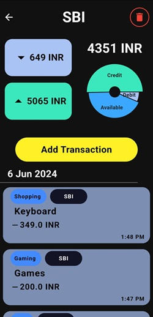

# Worthy

Worthy is a comprehensive transaction tracking app designed to help you manage your finances with ease and efficiency. With Worthy, you can effortlessly add and categorize your transactions, ensuring that your financial data is always organized and up-to-date.

## Key Features

-   **Add Transactions**: Quickly add transactions, specifying the account and category for each transaction.
-   **Monthly Overview**: View all your transactions month-wise, along with the total debit, total credit, and available balance for that period.
-   **Account Management**: Access detailed financial information for each account separately. Navigate to the accounts page, select the desired account, and view all associated transactions, along with the account’s total credit, total debit, and available balance.
-   **Categorization**: Organize your transactions by categories to gain better insights into your spending and saving habits.
-   **Financial Insights**: Get a clear picture of your overall financial health, with combined totals for all accounts as well as detailed breakdowns for individual accounts.

## Usage

-   **Add Account**:

    1. Navigate to the accounts page.
    2. Click on the floating Add button.
    3. Enter the required details for the new account.
    4. Save the account.

-   **Add Category**:

    1. Go to the category page.
    2. Click on the floating Add button.
    3. Enter the category name and any other relevant details.
    4. Save the category.

-   **Add Transaction**:
    1. On the home page, click on the floating Add button.
    2. On the add transaction page, provide the following inputs:
        - **Amount**: Enter the transaction amount.
        - **Credit/Debit**: Specify whether the transaction is a credit or debit.
        - **Account**: Select the account for the transaction.
        - **Category (Optional)**: Choose a category for the transaction.
        - **Note (Optional)**: Add a note for the transaction.
        - **Time (Current time default)**: Set the time for the transaction (defaults to the current time).
    3. Add the transaction.

## Screenshots

1. **Home Page**

    - 
    - 

2. **Accounts Page**

    - 

3. **Viewing an Account**

    - 

4. **Categories Page**

    - 

5. **Adding a Transaction**
    - 
